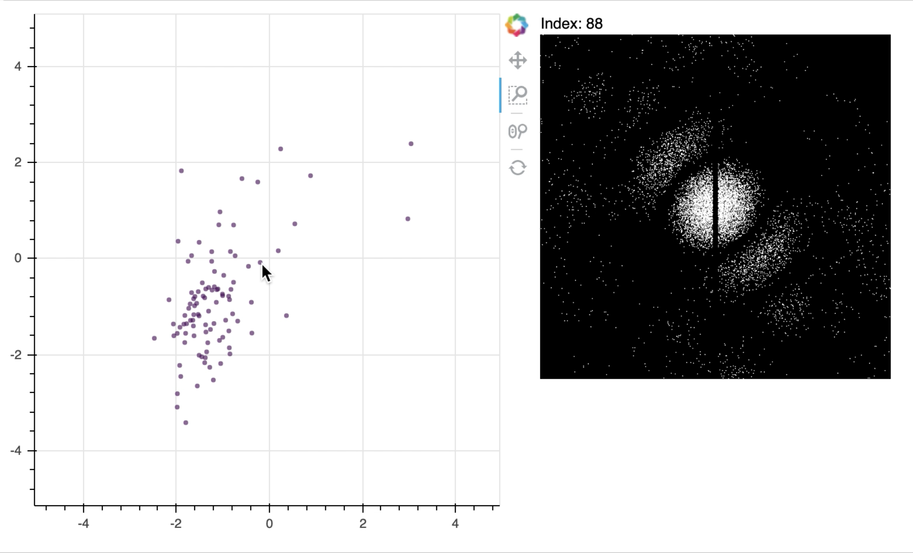

# LatentSpaceVisualizer

The Latent Space Visualizer is an interactive Python notebook that visualizes the latent space of an image dataset. The dataset contains a collection of latent variables that describes a set of labeled images. 

Two variables of the latent space are displayed in a 2D scatter plot. When the mouse is positioned near a point in the scatter plot, the image corresponding to that point is displayed to the side.



## Getting started

Clone this repository.

```bash
git clone https://github.com/compSPI/LatentSpaceVisualizer.git
```

Change the current working directory to the root of this repository.

```bash
cd /path/to/LatentSpaceVisualizer
```

Create the Python environment that has the dependencies required to run the code.

```bash
conda env create -f environment.yml
```

Activate the environment.
```bash
conda activate latent_space_visualizer
```

Install the kernel.
```bash
python -m ipykernel install --user --name latent_space_visualizer \ 
	--display-name "Python (latent_space_visualizer)"
```

Exit the environment.

```bash
conda deactivate
```

## Run the notebook

Run jupyter notebook.

```bash
jupyter notebook 
```

Open the tutorial notebook ```latent_space_visualizer.ipynb```.

Change the Python kernel to ```latent_space_visualizer```.

Set ```dataset_filepath``` to the file containing the dataset.

```python
dataset_filepath = '../data/cspi_synthetic_dataset_diffraction_patterns_1024x1040.npy'
```

Run the notebook.

## Code structure

The code for this repository is organized as follows:

- ```README.md```: Highlights the usefulness of the Latent Space Visualizer. 

- ```latent_space_visualizer.ipynb```:  Provides a tutorial notebook for using the Latent Space Visualizer.

- ```environment.yml```: Contains Python packages required to run the notebook.

- ```src/```: Contains Python files required to run the notebook.

- ```figures/```: Contains figures used in the repository.
