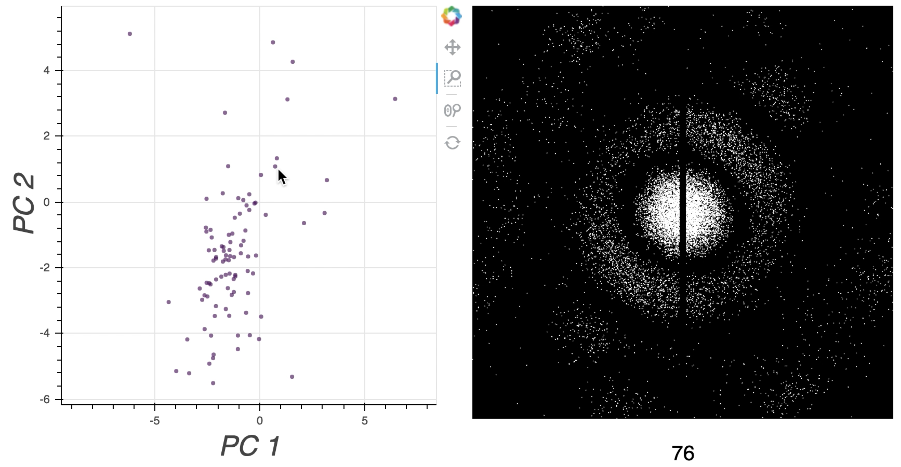

# LatentSpaceVisualizer

The Latent Space Visualizer is an interactive Python notebook that visualizes the latent space of an image dataset. The dataset contains a collection of latent variables that describes a set of labeled images. 

Two variables of the latent space are displayed in a 2D scatter plot. When the mouse is positioned near a point in the scatter plot, the image corresponding to that point is displayed to the side, as shown in Figure 1.

<center>

Figure 1
</center>

The code for this repository is organized as follows:

- ```README.md```: Highlights the usefulness of the Latent Space Visualizer. 

- ```latent_space_visualizer.ipynb```:  Provides a tutorial notebook for using the Latent Space Visualizer.

- ```environment.yml```: Contains Python packages required to run the notebook.

- ```src/```: Contains Python files required to run the notebook.

- ```figures/```: Contains figures used in the repository.